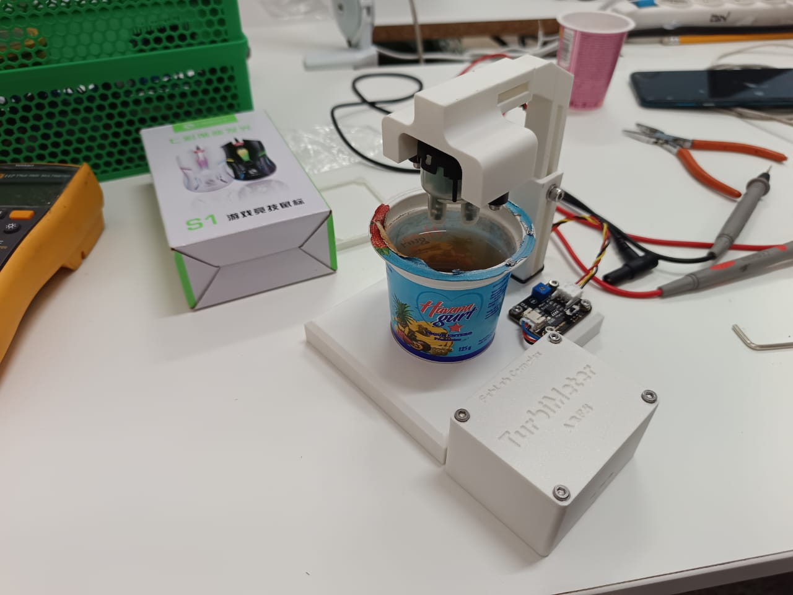
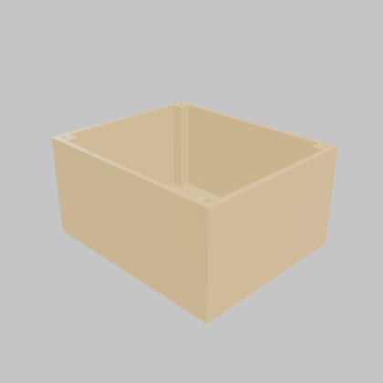
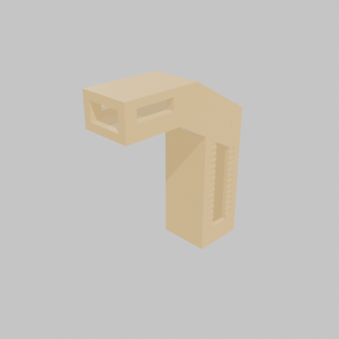
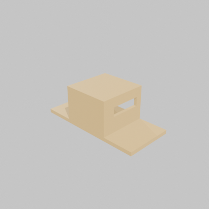

# Turbimeter - Citizen Science

Repository for the citizen-science turbidimeter project: 3D design, PCB, firmware, and data to measure water turbidity with community participation.



*The real prototype: 3D-printed enclosure, PCB, and sensor holder dipped in a test sample.*

## Table of contents

- [Structure](#structure)
- [Hardware](#hardware)
- [3D design (printing)](#3d-design-printing)
- [Bill of materials (BOM)](#bill-of-materials-bom)
- [Datasheets](#datasheets)
- [Firmware](#firmware)
  - [Hardware wiring](#hardware-wiring)
  - [General logic (loop)](#general-logic-loop)
  - [Calibration wizard](#why-theres-a-calibration-wizard)
  - [LED logic](#led-logic-evaluateleds)
  - [Full code](#full-code)
  - [Notes for anyone modifying the code](#notes-for-anyone-modifying-the-code)

## Structure

- `firmware/` - code for the sensor's microcontroller
- `hardware/` - schematics, PCB, 3D designs (KiCad project)
- `3D/` - parts for 3D printing (enclosure, sensor holder)
- `docs/` - documentation, BOM, datasheets, and guides
- `data/` - collected datasets
- `analysis/` - notebooks and data analysis scripts
- `img/` - photos and renders of the build/prototype

## Hardware

- **Sensor:** DFRobot SEN0189 (turbidity)
- **Controller:** Arduino Nano
- Full KiCad project in `hardware/`: schematic (`esque.kicad_sch`),
  PCB (`esque.kicad_pcb`), 3D model (`esque.step`), and manufacturing
  files (`hardware/gerber/`).


*PCB render (`hardware/esque.step`) generated with `kicad-cli`.*


*Assembly render: Arduino Nano + sensor holder on top of the 3D-printed case.*

<details>
<summary><b>See the Arduino Nano pinout</b> (official Arduino reference)</summary>
<br>

</details>

## 3D design (printing)

Parts in [`3D/`](3D/), ready to download and print (STL). Clicking any file
on GitHub opens an interactive 3D preview right on the site; here's also a
spinning render of each part.

| Part | Preview | Download |
|------|:---:|:---:|
| **CASE** — main body, houses the Arduino Nano |  | [CASE.stl](3D/CASE.stl) |
| **LID** — case lid |  | [LID.stl](3D/LID.stl) |
| **NECK** — connects the case to the sensor holder |  | [NECK.stl](3D/NECK.stl) |
| **SENSOR-HOLDER** — mount for the DFRobot SEN0189 sensor |  | [SENSOR-HOLDER.stl](3D/SENSOR-HOLDER.stl) |

## Bill of materials (BOM)

Full table and calibration notes in **[docs/BOM.md](docs/BOM.md)**.
Components pulled directly from the real schematic
(`kicad-cli sch export bom`), not made up:

| Photo | Component | Refs. | Qty | Buy |
|------|------------|:---:|:---:|:---:|
|  | Arduino Nano | A1 | 1 | [Arduino Store](https://store.arduino.cc/products/arduino-nano) |
|  | DFRobot SEN0189 turbidity sensor | J2 | 1 | [DFRobot](https://www.dfrobot.com/product-1394.html) |
|  | 5mm LED (red/yellow/green) | D1-D3 | 3 | [SparkFun](https://www.sparkfun.com/led-assorted-20-pack.html) |
|  | 330 Ω resistor, 1/4W | R1-R3, R5, R6 | 5 | [SparkFun](https://www.sparkfun.com/resistor-330-ohm-1-4-watt-pth-20-pack-thick-leads.html) |
|  | 2.54mm pin header | J2, J3 | 1 strip | [SparkFun](https://www.sparkfun.com/break-away-headers-straight.html) |
|  | Female-to-female jumper wires | — | ~4 | [SparkFun](https://www.sparkfun.com/jumper-wires-premium-6-f-f-pack-of-10.html) |

<details>
<summary><b>How do you read a resistor's color code?</b></summary>
<br>


*Diagram: SparkFun Learn - Resistors.*
</details>

<details>
<summary><b>Why does the LED need a series resistor?</b></summary>
<br>


*The resistor limits the current through the LED so it doesn't burn out. Diagram: SparkFun Learn.*
</details>

## Datasheets

| Component | File |
|------------|---------|
| Arduino Nano (A000005) | [docs/datasheets/arduino-nano.pdf](docs/datasheets/arduino-nano.pdf) |
| DFRobot SEN0189 turbidity sensor | [docs/datasheets/dfrobot-sen0189.pdf](docs/datasheets/dfrobot-sen0189.pdf) |

## Firmware

[`firmware/firmware.ino`](firmware/firmware.ino) reads the DFRobot SEN0189
turbidity sensor from an Arduino Nano, calculates an approximate NTU value,
and turns on an LED (green/yellow/red) based on the detected turbidity
level. It includes an interactive calibration wizard over the Serial
Monitor.

### Hardware wiring

| Sensor wire | Destination |
|-------------------|---------|
| Red (VCC) | 5V |
| Black (GND) | GND |
| Blue (analog signal) | Pin A1 |


*Sensor wiring diagram. Source: DFRobot Wiki (official).*

There are also 3 indicator LEDs (green/yellow/red) on configurable digital
pins (10, 9, and 8 by default) to visually show the turbidity level without
needing to watch the Serial Monitor.

### General logic (`loop`)

1. **Reading the sensor:** instead of taking a single analog reading (which
   would be noisy), it averages **800** consecutive `analogRead(A1)` samples
   with a small pause between each one (`delayMicroseconds(500)`). This
   stabilizes the value before it's used.
2. **Converting to voltage:** the average (0–1023, 10-bit ADC resolution) is
   scaled to a real voltage using the Arduino's 5V reference:
   `voltage = average * (5.0 / 1023.0)`.
3. **Converting to NTU:** a second-degree polynomial formula
   (`ntu = A*v² + B*v + C`) is applied, with coefficients taken from the
   Arduino community (not an official DFRobot value — the manufacturer only
   publishes a reference graph, not an equation). Below 2.5V, maximum
   turbidity (3000 NTU) is assumed, since the sensor's curve is no longer
   reliable in that range.
4. **Output:** the voltage and NTU value are printed to the Serial Monitor,
   and if not currently calibrating, the corresponding "level" is evaluated
   to turn on the right LED.

### Why there's a calibration wizard

Since the NTU formula is just a generic approximation, the code doesn't
trust it to decide when to turn on each LED. Instead, it lets you calibrate
the **thresholds** using real water samples from the actual sensor:

1. Type `C` in the Serial Monitor to start.
2. You're asked to dip the sensor in **clear water**, fixed with `F`.
3. You're asked for **medium turbidity water** (suggests yellow dye), fixed
   with `F`.
4. You're asked for **high turbidity water** (suggests coffee or dark ink),
   fixed with `F`.
5. You finish with `X`, which:
   - Calculates the thresholds as the midpoint between each pair of samples
     (`recalculateThresholds()`).
   - Saves the 3 reference NTU values to the Arduino's **EEPROM**
     (`saveCalibrationToEEPROM()`), so the calibration isn't lost when the
     device is powered off.

On power-up, `loadCalibrationFromEEPROM()` checks whether a calibration was
already saved (using a "flag" at EEPROM address 12) and, if so, loads it
instead of using the default values.

### LED logic (`evaluateLeds`)

With the 3 calibrated points (clear / medium / turbid), two intermediate
thresholds are calculated:

- `MEDIUM_TURBIDITY_THRESHOLD` = midpoint between "clear" and "medium"
- `HIGH_TURBIDITY_THRESHOLD` = midpoint between "medium" and "turbid"

Then:

- NTU > `HIGH_TURBIDITY_THRESHOLD` → **red LED** (high turbidity)
- NTU > `MEDIUM_TURBIDITY_THRESHOLD` → **yellow LED** (medium turbidity)
- otherwise → **green LED** (low turbidity)

### Full code

<details>
<summary><b>View the complete <code>firmware/firmware.ino</code></b> (click to expand — the copy button appears at the top right of the code block)</summary>

```cpp
/*
  ============================================================
   DFROBOT SEN0189 TURBIDITY SENSOR + ARDUINO NANO
   VERSION 1: NTU CALCULATION + INTERACTIVE SERIAL CALIBRATION
  ============================================================
  Description:
   Reads the turbidity sensor, calculates an approximate NTU
   value using a polynomial formula, and turns on an LED based
   on the detected level. Includes a manual calibration wizard
   controlled by typing letters into the Serial Monitor.

  *** WARNING ***
   The NTU formula used here is a widely-used approximation from
   the Arduino community, NOT an official equation published by
   DFRobot (they only publish a reference graph). That's why this
   code calibrates the LED THRESHOLDS using your own real water
   samples instead of blindly trusting the formula.

  Sensor wiring:
   - RED wire   -> 5V
   - BLACK wire -> GND
   - BLUE wire  -> Analog pin A1 (signal)

  REQUIRED LIBRARIES:
   - No external library needed for the sensor (just analogRead).
   - <EEPROM.h> is used to permanently store the calibration. It's
     a NATIVE Arduino library, already bundled with the IDE, no
     download needed.

  ============================================================
                 CALIBRATION GUIDE (Serial Monitor)
  ============================================================
   1. Open the Serial Monitor (Ctrl+Shift+M) at 9600 baud.
   2. Type the letter  C  and press Enter -> starts calibration.
   3. The program will ask you to dip the sensor in CLEAR water
      (pure water). Wait for the reading to stabilize and type
      F  + Enter to fix that point.
   4. Then it will ask for WATER WITH YELLOW DYE (medium turbidity).
      Dip the sensor, wait for it to stabilize, and type
      F  + Enter to fix that point.
   5. Then it will ask for WATER WITH DISSOLVED COFFEE OR DARK INK
      (high turbidity). Dip the sensor, wait for it to stabilize,
      and type  F  + Enter to fix that point.
   6. Finally type  X  + Enter to FINISH the calibration. The
      values are calculated and automatically saved to EEPROM.

   Suggestion for the "high turbidity" sample: dissolve a bit of
   instant coffee in water, or use diluted india ink. Avoid toxic
   or corrosive substances, since the sensor will stay submerged
   for several seconds.
  ============================================================
*/

#include <EEPROM.h> // Native Arduino library used to store data permanently

// ------------------- PIN CONFIGURATION -------------------

const int TURBIDITY_SENSOR_PIN = A1; // Sensor's blue (signal) wire

// >>> SET THE DIGITAL PINS YOU'RE ACTUALLY USING HERE <<<
const int RED_LED_PIN    = 8;   // <-- CHANGE: RED LED digital pin
const int YELLOW_LED_PIN = 9;   // <-- CHANGE: YELLOW LED digital pin
const int GREEN_LED_PIN  = 10;  // <-- CHANGE: GREEN LED digital pin

const int NUMBER_OF_SAMPLES = 800; // Readings to average to reduce noise

// ------------------- NTU FORMULA CONSTANTS -------------------
const float ARDUINO_REFERENCE_VOLTAGE = 5.00; // <-- ADJUST if your real 5V differs
float COEF_A = -1120.4; // <-- ADJUST only if you run your own regression with real NTU
float COEF_B = 5742.3;  // <-- ADJUST only if you run your own regression with real NTU
float COEF_C = -4352.9; // <-- ADJUST only if you run your own regression with real NTU

// ------------------- EEPROM MEMORY ADDRESSES -------------------
// Each float takes 4 bytes, so addresses are spaced 4 apart
const int CLEAR_NTU_ADDRESS      = 0;
const int MEDIUM_NTU_ADDRESS     = 4;
const int TURBID_NTU_ADDRESS     = 8;
const int CALIBRATED_FLAG_ADDRESS = 12; // Flag: 1 = already calibrated before

// ------------------- CALIBRATION VARIABLES (IN NTU) -------------------
// These values are calculated during calibration, or loaded from EEPROM
// if it was already calibrated before. They act as thresholds for the LEDs.
float clearWaterNtu  = 200.0;  // Default value until calibrated
float mediumWaterNtu = 1000.0; // Default value until calibrated
float turbidWaterNtu = 2500.0; // Default value until calibrated

float HIGH_TURBIDITY_THRESHOLD;   // Automatically calculated between medium and turbid
float MEDIUM_TURBIDITY_THRESHOLD; // Automatically calculated between clear and medium

// ------------------- CALIBRATION STATE VARIABLES -------------------
bool calibrating = false;   // true while the wizard is active
int  calibrationStep = 0;   // 0=inactive, 1=clear water, 2=medium water, 3=turbid water


void setup() {
  Serial.begin(9600);

  pinMode(RED_LED_PIN, OUTPUT);
  pinMode(YELLOW_LED_PIN, OUTPUT);
  pinMode(GREEN_LED_PIN, OUTPUT);
  turnOffAllLeds();

  loadCalibrationFromEEPROM();
  recalculateThresholds();

  Serial.println("============================================");
  Serial.println(" DFRobot turbidity sensor - NTU mode");
  Serial.println(" Type 'C' + Enter to start calibration");
  Serial.println("============================================");
}


void loop() {

  // ---------- Check if the user typed something in the Serial Monitor ----------
  if (Serial.available() > 0) {
    char receivedKey = Serial.read();
    processKey(receivedKey);
  }

  // ---------- STEP 1: READ THE SENSOR MULTIPLE TIMES ----------
  long readingSum = 0;
  for (int i = 0; i < NUMBER_OF_SAMPLES; i++) {
    readingSum += analogRead(TURBIDITY_SENSOR_PIN);
    delayMicroseconds(500);
  }
  float averageReading = readingSum / (float)NUMBER_OF_SAMPLES;

  // ---------- STEP 2: CONVERT TO VOLTAGE ----------
  float voltage = averageReading * (ARDUINO_REFERENCE_VOLTAGE / 1023.0);

  // ---------- STEP 3: CONVERT TO NTU ----------
  float ntu = calculateNTU(voltage);

  // ---------- STEP 4: SHOW THE READING ON THE SERIAL MONITOR ----------
  Serial.print("Voltage: ");
  Serial.print(voltage, 3);
  Serial.print(" V  |  Estimated NTU: ");
  Serial.print(ntu, 1);

  if (calibrating) {
    // While calibrating, LEDs are not evaluated, only the reading is shown
    Serial.print("   [CALIBRATING - Step ");
    Serial.print(calibrationStep);
    Serial.println(" of 3]");
  } else {
    // ---------- STEP 5: EVALUATE THE 3 LED CONDITIONS ----------
    Serial.print("  |  Status: ");
    evaluateLeds(ntu);
  }

  delay(500); // Update every half second
}


// ============================================================
//                   CALIBRATION FUNCTIONS
// ============================================================

void processKey(char key) {

  if (key == 'C' || key == 'c') {
    // ----- Start calibration -----
    calibrating = true;
    calibrationStep = 1;
    Serial.println();
    Serial.println("### CALIBRATION STARTED ###");
    Serial.println("Step 1/3: Dip the sensor in CLEAR (pure) water.");
    Serial.println("Once the reading stabilizes, type 'F' + Enter.");
  }
  else if ((key == 'F' || key == 'f') && calibrating) {
    // ----- Fix the current value for the current step -----
    float currentVoltage = readAverageVoltage();
    float currentNtu = calculateNTU(currentVoltage);

    if (calibrationStep == 1) {
      clearWaterNtu = currentNtu;
      Serial.print("Value fixed for CLEAR WATER: ");
      Serial.print(currentNtu, 1);
      Serial.println(" NTU");
      Serial.println("Step 2/3: Dip the sensor in WATER WITH YELLOW DYE.");
      Serial.println("Once the reading stabilizes, type 'F' + Enter.");
      calibrationStep = 2;
    }
    else if (calibrationStep == 2) {
      mediumWaterNtu = currentNtu;
      Serial.print("Value fixed for MEDIUM (yellow) WATER: ");
      Serial.print(currentNtu, 1);
      Serial.println(" NTU");
      Serial.println("Step 3/3: Dip the sensor in WATER WITH COFFEE/DARK INK.");
      Serial.println("Once the reading stabilizes, type 'F' + Enter.");
      calibrationStep = 3;
    }
    else if (calibrationStep == 3) {
      turbidWaterNtu = currentNtu;
      Serial.print("Value fixed for TURBID (dark) WATER: ");
      Serial.print(currentNtu, 1);
      Serial.println(" NTU");
      Serial.println("All 3 points have been fixed.");
      Serial.println("Type 'X' + Enter to FINISH and save the calibration.");
      calibrationStep = 4; // Waiting to finish
    }
    else {
      Serial.println("You already fixed the 3 points. Type 'X' to finish.");
    }
  }
  else if ((key == 'X' || key == 'x') && calibrating) {
    // ----- Finish calibration -----
    if (calibrationStep < 4) {
      Serial.println("You haven't fixed the 3 points with 'F' yet. Can't finish yet.");
    } else {
      recalculateThresholds();
      saveCalibrationToEEPROM();
      calibrating = false;
      calibrationStep = 0;
      Serial.println("### CALIBRATION FINISHED AND SAVED TO MEMORY ###");
      Serial.println("Returning to normal operation...");
      Serial.println();
    }
  }
}

// Reads the sensor multiple times and returns the average voltage (used during calibration)
float readAverageVoltage() {
  long readingSum = 0;
  for (int i = 0; i < NUMBER_OF_SAMPLES; i++) {
    readingSum += analogRead(TURBIDITY_SENSOR_PIN);
    delayMicroseconds(500);
  }
  float averageReading = readingSum / (float)NUMBER_OF_SAMPLES;
  return averageReading * (ARDUINO_REFERENCE_VOLTAGE / 1023.0);
}

// Converts a voltage to NTU using the polynomial formula
float calculateNTU(float voltage) {
  float ntu;
  if (voltage < 2.5) {
    ntu = 3000;
  } else {
    ntu = (COEF_A * voltage * voltage) + (COEF_B * voltage) + COEF_C;
  }
  if (ntu < 0) ntu = 0;
  return ntu;
}

// Calculates the LED thresholds as midpoints between the 3 calibrated samples
void recalculateThresholds() {
  MEDIUM_TURBIDITY_THRESHOLD = (clearWaterNtu + mediumWaterNtu) / 2.0;
  HIGH_TURBIDITY_THRESHOLD   = (mediumWaterNtu + turbidWaterNtu) / 2.0;
}

// Permanently saves the 3 calibrated values to EEPROM
void saveCalibrationToEEPROM() {
  EEPROM.put(CLEAR_NTU_ADDRESS, clearWaterNtu);
  EEPROM.put(MEDIUM_NTU_ADDRESS, mediumWaterNtu);
  EEPROM.put(TURBID_NTU_ADDRESS, turbidWaterNtu);
  EEPROM.put(CALIBRATED_FLAG_ADDRESS, (byte)1); // Marks that a calibration is already saved
}

// Loads a previously saved calibration (if any) when the Arduino powers on
void loadCalibrationFromEEPROM() {
  byte calibratedFlag;
  EEPROM.get(CALIBRATED_FLAG_ADDRESS, calibratedFlag);

  if (calibratedFlag == 1) {
    EEPROM.get(CLEAR_NTU_ADDRESS, clearWaterNtu);
    EEPROM.get(MEDIUM_NTU_ADDRESS, mediumWaterNtu);
    EEPROM.get(TURBID_NTU_ADDRESS, turbidWaterNtu);
    Serial.println("A previously saved calibration was loaded.");
  } else {
    Serial.println("No saved calibration found. Using default values.");
  }
}

// ============================================================
//                     LED FUNCTIONS
// ============================================================

void turnOffAllLeds() {
  digitalWrite(RED_LED_PIN, LOW);
  digitalWrite(YELLOW_LED_PIN, LOW);
  digitalWrite(GREEN_LED_PIN, LOW);
}

// Evaluates the 3 conditions and turns on the corresponding LED
void evaluateLeds(float ntu) {
  if (ntu > HIGH_TURBIDITY_THRESHOLD) {
    digitalWrite(RED_LED_PIN, HIGH);
    digitalWrite(YELLOW_LED_PIN, LOW);
    digitalWrite(GREEN_LED_PIN, LOW);
    Serial.println("HIGH TURBIDITY - RED LED");
  }
  else if (ntu > MEDIUM_TURBIDITY_THRESHOLD) {
    digitalWrite(RED_LED_PIN, LOW);
    digitalWrite(YELLOW_LED_PIN, HIGH);
    digitalWrite(GREEN_LED_PIN, LOW);
    Serial.println("MEDIUM TURBIDITY - YELLOW LED");
  }
  else {
    digitalWrite(RED_LED_PIN, LOW);
    digitalWrite(YELLOW_LED_PIN, LOW);
    digitalWrite(GREEN_LED_PIN, HIGH);
    Serial.println("LOW TURBIDITY - GREEN LED");
  }
}
```

</details>

### Notes for anyone modifying the code

- The LED pins (`RED_LED_PIN`/`YELLOW_LED_PIN`/`GREEN_LED_PIN`) are marked
  in the code as `<-- CHANGE` because they depend on how each board is
  wired.
- `NUMBER_OF_SAMPLES = 800` is a trade-off between reading stability and
  refresh speed (more samples = more precise but slower refresh, currently
  about every 0.5s plus sampling time).
- The `COEF_A/B/C` coefficients should only be touched if you run your own
  regression with real NTU values (e.g. with a reference turbidimeter) —
  something still pending for this project. Today, reliability comes from
  the manually calibrated thresholds, not from the formula.

*(This analysis is also available as a standalone document in [docs/firmware.md](docs/firmware.md).)*
