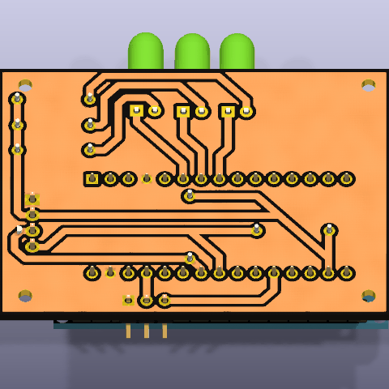

# Turbimeter - Citizen Science

Repositorio del proyecto de turbidímetro para ciencia ciudadana: diseño, firmware y datos para medir la turbidez del agua con participación comunitaria.

## Índice

- [Estructura](#estructura)
- [Hardware](#hardware)
- [Lista de materiales (BOM)](#lista-de-materiales-bom)
- [Firmware](#firmware)
  - [Conexión del hardware](#conexión-del-hardware)
  - [Lógica general (loop)](#lógica-general-loop)
  - [Asistente de calibración](#por-qué-tiene-un-asistente-de-calibración)
  - [Lógica de los LEDs](#lógica-de-los-leds-evaluarleds)
  - [Notas para modificar el código](#notas-para-quien-vaya-a-modificar-el-código)
- [Estado y próximos pasos](#estado-y-próximos-pasos)

## Estructura

- `firmware/` - código para el microcontrolador del sensor
- `hardware/` - esquemáticos, PCB, diseños 3D (proyecto KiCad)
- `docs/` - documentación, guías de armado, BOM y calibración
- `data/` - datasets recolectados
- `analysis/` - notebooks y scripts de análisis de datos
- `img/` - fotos del armado/prototipo

## Hardware

- **Sensor:** DFRobot SEN0189 (turbidez)
- **Controlador:** Arduino Nano
- Proyecto KiCad completo en `hardware/`: esquemático (`esque.kicad_sch`),
  PCB (`esque.kicad_pcb`), modelo 3D (`esque.step`) y archivos de fabricación
  (`hardware/gerber/`).

*Render del PCB (`hardware/esque.step`) generado con `kicad-cli`.*

## Lista de materiales (BOM)

Tabla completa con foto y enlace de compra de cada componente (extraída del
esquemático real, no inventada): **[docs/BOM.md](docs/BOM.md)**.

Resumen rápido:

| Componente | Cant. | Refs. |
|------------|:---:|:---:|
| Arduino Nano | 1 | A1 |
| Sensor de turbidez DFRobot SEN0189 | 1 | J2 |
| LED 5mm (rojo/amarillo/verde) | 3 | D1-D3 |
| Resistor 330 Ω 1/4W | 5 | R1-R3, R5, R6 |
| Header de pines 2.54mm | 3+4 pines | J2, J3 |
| Cable jumper hembra-hembra | ~4 | — |

## Firmware

[`firmware/firmware.ino`](firmware/firmware.ino) lee el sensor de turbidez
DFRobot SEN0189 desde un Arduino Nano, calcula un valor aproximado en NTU y
enciende un LED (verde/amarillo/rojo) según el nivel de turbidez detectado.
Incluye un asistente de calibración interactiva por Monitor Serial.

### Conexión del hardware

| Cable del sensor | Destino |
|-------------------|---------|
| Rojo (VCC) | 5V |
| Negro (GND) | GND |
| Azul (señal analógica) | Pin A1 |

Además, 3 LEDs indicadores (verde/amarillo/rojo) en pines digitales
configurables (por defecto 10, 9 y 8) para mostrar el nivel de turbidez de
forma visual, sin necesidad de mirar el Monitor Serial.

### Lógica general (`loop`)

1. **Lectura del sensor:** en vez de tomar una sola lectura analógica (que
   tendría ruido), promedia **800 muestras** consecutivas de `analogRead(A1)`
   con una pequeña pausa entre cada una (`delayMicroseconds(500)`). Esto
   estabiliza el valor antes de usarlo.
2. **Conversión a voltaje:** el promedio (0–1023, resolución del ADC de 10
   bits) se escala a un voltaje real usando la referencia de 5V del Arduino:
   `voltaje = promedio * (5.0 / 1023.0)`.
3. **Conversión a NTU:** se aplica una fórmula polinómica de segundo grado
   (`ntu = A*v² + B*v + C`) con coeficientes tomados de la comunidad de
   Arduino (no son un valor oficial de DFRobot — el fabricante solo publica
   una gráfica de referencia, no una ecuación). Por debajo de 2.5V se asume
   el máximo de turbidez (3000 NTU), ya que la curva del sensor deja de ser
   confiable en ese rango.
4. **Salida:** el valor de voltaje y NTU se imprime por el Monitor Serial, y
   si no se está calibrando, se evalúa a qué "nivel" corresponde para
   encender el LED correspondiente.

### Por qué tiene un asistente de calibración

Como la fórmula NTU es solo una aproximación genérica, el código no confía
en ella para decidir cuándo encender cada LED. En cambio, permite calibrar
los **umbrales** con muestras de agua reales del propio sensor:

1. Se escribe `C` por el Monitor Serial para iniciar.
2. Se pide sumergir el sensor en **agua clara**, y se fija ese punto con `F`.
3. Se pide **agua con turbidez media** (sugiere tinte amarillo), y se fija
   con `F`.
4. Se pide **agua con turbidez alta** (sugiere café o tinta oscura), y se
   fija con `F`.
5. Se finaliza con `X`, lo que:
   - Calcula los umbrales como el punto medio entre cada par de muestras
     (`recalcularUmbrales()`).
   - Guarda los 3 valores NTU de referencia en la **EEPROM** del Arduino
     (`guardarCalibracionEnEEPROM()`), para no perder la calibración al
     desconectar el equipo.

Al encender el Arduino, `cargarCalibracionDesdeEEPROM()` revisa si ya existe
una calibración guardada (usa una "bandera" en la dirección 12 de la
EEPROM) y, si la hay, la carga en lugar de usar los valores por defecto.

### Lógica de los LEDs (`evaluarLeds`)

Con los 3 puntos calibrados (clara / media / turbia) se calculan dos
umbrales intermedios:

- `UMBRAL_TURBIDEZ_MEDIA` = punto medio entre "clara" y "media"
- `UMBRAL_TURBIDEZ_ALTA` = punto medio entre "media" y "turbia"

Y luego:

- NTU > `UMBRAL_TURBIDEZ_ALTA` → **LED rojo** (turbidez alta)
- NTU > `UMBRAL_TURBIDEZ_MEDIA` → **LED amarillo** (turbidez media)
- en cualquier otro caso → **LED verde** (turbidez baja)

### Notas para quien vaya a modificar el código

- Los pines de los LEDs (`PIN_LED_ROJO/AMARILLO/VERDE`) están marcados en el
  código como `<-- CAMBIAR` porque dependen de cómo se cablee cada placa.
- `NUMERO_DE_MUESTRAS = 800` es un compromiso entre estabilidad de la
  lectura y velocidad de actualización (a más muestras, más preciso pero
  más lento el refresco, hoy cada ~0.5s más el tiempo de muestreo).
- Los coeficientes `COEF_A/B/C` solo deberían tocarse si se hace una
  regresión propia con NTU reales (ej. con un turbidímetro de referencia),
  algo pendiente para este proyecto — hoy la fiabilidad viene de los
  umbrales calibrados manualmente, no de la fórmula.

*(Análisis también disponible como documento independiente en [docs/firmware.md](docs/firmware.md).)*

## Estado y próximos pasos

Prototipo en desarrollo: firmware, diseño de PCB y BOM ya cargados.

Pendiente:
- [ ] Guía de armado real paso a paso (con fotos del proceso)
- [ ] Fijar el valor real de los resistores en el esquemático
- [ ] Regresión propia de la fórmula NTU con muestras de agua reales
- [ ] Resultados de campo reales de la comunidad (reemplazando el contenido
      de ejemplo que hubo antes en `docs/`)
- [ ] Definir gabinete/cámara de muestra y fuente de alimentación final
