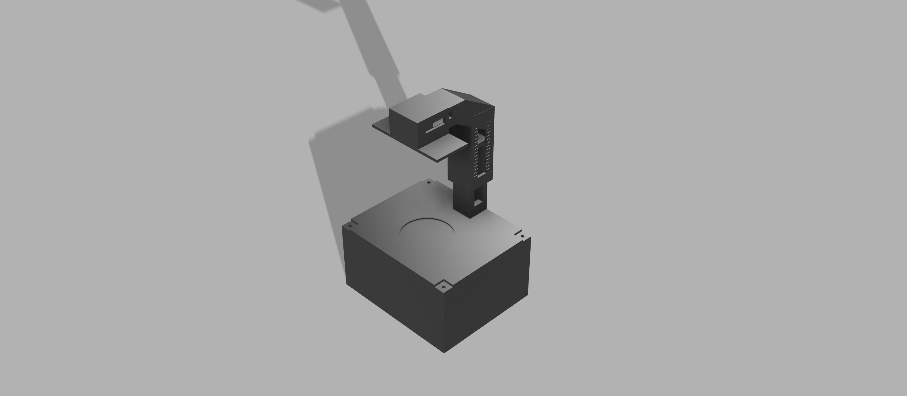
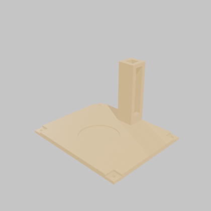

# Turbimeter - Citizen Science

Repositorio del proyecto de turbidímetro para ciencia ciudadana: diseño 3D, PCB, firmware y datos para medir la turbidez del agua con participación comunitaria.

## Índice

- [Estructura](#estructura)
- [Hardware](#hardware)
- [Diseño 3D (impresión)](#diseño-3d-impresión)
- [Lista de materiales (BOM)](#lista-de-materiales-bom)
- [Datasheets](#datasheets)
- [Firmware](#firmware)
  - [Conexión del hardware](#conexión-del-hardware)
  - [Lógica general (loop)](#lógica-general-loop)
  - [Asistente de calibración](#por-qué-tiene-un-asistente-de-calibración)
  - [Lógica de los LEDs](#lógica-de-los-leds-evaluarleds)
  - [Código completo](#código-completo)
  - [Notas para modificar el código](#notas-para-quien-vaya-a-modificar-el-código)
- [Estado y próximos pasos](#estado-y-próximos-pasos)

## Estructura

- `firmware/` - código para el microcontrolador del sensor
- `hardware/` - esquemáticos, PCB, diseños 3D (proyecto KiCad)
- `3D/` - piezas para imprimir en 3D (carcasa, porta-sensor)
- `docs/` - documentación, BOM, datasheets y guías
- `data/` - datasets recolectados
- `analysis/` - notebooks y scripts de análisis de datos
- `img/` - fotos y renders del armado/prototipo

## Hardware

- **Sensor:** DFRobot SEN0189 (turbidez)
- **Controlador:** Arduino Nano
- Proyecto KiCad completo en `hardware/`: esquemático (`esque.kicad_sch`),
  PCB (`esque.kicad_pcb`), modelo 3D (`esque.step`) y archivos de fabricación
  (`hardware/gerber/`).


*Render del PCB (`hardware/esque.step`) generado con `kicad-cli`.*



*Render del ensamble: Arduino Nano + porta-sensor sobre la caja impresa en 3D.*

<details>
<summary><b>Ver pinout del Arduino Nano</b> (referencia oficial de Arduino)</summary>
<br>

</details>

## Diseño 3D (impresión)

Piezas en [`3D/`](3D/), listas para descargar e imprimir (STL). Al hacer clic
en cada archivo dentro de GitHub se abre una previsualización 3D interactiva
del propio sitio; acá además va un render giratorio de cada pieza.

| Pieza | Previsualización | Descargar |
|-------|:---:|:---:|
| **CAJA** — cuerpo principal, aloja el Arduino Nano |  | [CAJA.stl](3D/CAJA.stl) |
| **TAPA** — tapa de la caja |  | [TAPA.stl](3D/TAPA.stl) |
| **CUELLO** — cuello que conecta la caja con el porta-sensor |  | [CUELLO.stl](3D/CUELLO.stl) |
| **PORTA-SENSOR** — soporte del sensor DFRobot SEN0189 |  | [PORTA-SENSOR.stl](3D/PORTA-SENSOR.stl) |

## Lista de materiales (BOM)

Tabla completa y notas de calibración en **[docs/BOM.md](docs/BOM.md)**.
Componentes extraídos directamente del esquemático real
(`kicad-cli sch export bom`), no inventados:

| Foto | Componente | Refs. | Cant. | Comprar |
|------|------------|:---:|:---:|:---:|
|  | Arduino Nano | A1 | 1 | [Arduino Store](https://store.arduino.cc/products/arduino-nano) |
|  | Sensor turbidez DFRobot SEN0189 | J2 | 1 | [DFRobot](https://www.dfrobot.com/product-1394.html) |
|  | LED 5mm (rojo/amarillo/verde) | D1-D3 | 3 | [SparkFun](https://www.sparkfun.com/led-assorted-20-pack.html) |
|  | Resistor 330 Ω 1/4W | R1-R3, R5, R6 | 5 | [SparkFun](https://www.sparkfun.com/resistor-330-ohm-1-4-watt-pth-20-pack-thick-leads.html) |
|  | Header de pines 2.54mm | J2, J3 | 1 tira | [SparkFun](https://www.sparkfun.com/break-away-headers-straight.html) |
|  | Cable jumper hembra-hembra | — | ~4 | [SparkFun](https://www.sparkfun.com/jumper-wires-premium-6-f-f-pack-of-10.html) |

<details>
<summary><b>¿Cómo se lee el código de colores de un resistor?</b></summary>
<br>


*Diagrama: SparkFun Learn - Resistors.*
</details>

<details>
<summary><b>¿Por qué el LED necesita un resistor en serie?</b></summary>
<br>


*El resistor limita la corriente que pasa por el LED para no quemarlo. Diagrama: SparkFun Learn.*
</details>

## Datasheets

| Componente | Archivo |
|------------|---------|
| Arduino Nano (A000005) | [docs/datasheets/arduino-nano.pdf](docs/datasheets/arduino-nano.pdf) |
| Sensor turbidez DFRobot SEN0189 | [docs/datasheets/dfrobot-sen0189.pdf](docs/datasheets/dfrobot-sen0189.pdf) |

## Firmware

[`firmware/firmware.ino`](firmware/firmware.ino) lee el sensor de turbidez
DFRobot SEN0189 desde un Arduino Nano, calcula un valor aproximado en NTU y
enciende un LED (verde/amarillo/rojo) según el nivel de turbidez detectado.
Incluye un asistente de calibración interactiva por Monitor Serial.

### Conexión del hardware

| Cable del sensor | Destino |
|-------------------|---------|
| Rojo (VCC) | 5V |
| Negro (GND) | GND |
| Azul (señal analógica) | Pin A1 |


*Diagrama de conexión del sensor. Fuente: DFRobot Wiki (oficial).*

Además, 3 LEDs indicadores (verde/amarillo/rojo) en pines digitales
configurables (por defecto 10, 9 y 8) para mostrar el nivel de turbidez de
forma visual, sin necesidad de mirar el Monitor Serial.

### Lógica general (`loop`)

1. **Lectura del sensor:** en vez de tomar una sola lectura analógica (que
   tendría ruido), promedia **800 muestras** consecutivas de `analogRead(A1)`
   con una pequeña pausa entre cada una (`delayMicroseconds(500)`). Esto
   estabiliza el valor antes de usarlo.
2. **Conversión a voltaje:** el promedio (0–1023, resolución del ADC de 10
   bits) se escala a un voltaje real usando la referencia de 5V del Arduino:
   `voltaje = promedio * (5.0 / 1023.0)`.
3. **Conversión a NTU:** se aplica una fórmula polinómica de segundo grado
   (`ntu = A*v² + B*v + C`) con coeficientes tomados de la comunidad de
   Arduino (no son un valor oficial de DFRobot — el fabricante solo publica
   una gráfica de referencia, no una ecuación). Por debajo de 2.5V se asume
   el máximo de turbidez (3000 NTU), ya que la curva del sensor deja de ser
   confiable en ese rango.
4. **Salida:** el valor de voltaje y NTU se imprime por el Monitor Serial, y
   si no se está calibrando, se evalúa a qué "nivel" corresponde para
   encender el LED correspondiente.

### Por qué tiene un asistente de calibración

Como la fórmula NTU es solo una aproximación genérica, el código no confía
en ella para decidir cuándo encender cada LED. En cambio, permite calibrar
los **umbrales** con muestras de agua reales del propio sensor:

1. Se escribe `C` por el Monitor Serial para iniciar.
2. Se pide sumergir el sensor en **agua clara**, y se fija ese punto con `F`.
3. Se pide **agua con turbidez media** (sugiere tinte amarillo), y se fija
   con `F`.
4. Se pide **agua con turbidez alta** (sugiere café o tinta oscura), y se
   fija con `F`.
5. Se finaliza con `X`, lo que:
   - Calcula los umbrales como el punto medio entre cada par de muestras
     (`recalcularUmbrales()`).
   - Guarda los 3 valores NTU de referencia en la **EEPROM** del Arduino
     (`guardarCalibracionEnEEPROM()`), para no perder la calibración al
     desconectar el equipo.

Al encender el Arduino, `cargarCalibracionDesdeEEPROM()` revisa si ya existe
una calibración guardada (usa una "bandera" en la dirección 12 de la
EEPROM) y, si la hay, la carga en lugar de usar los valores por defecto.

### Lógica de los LEDs (`evaluarLeds`)

Con los 3 puntos calibrados (clara / media / turbia) se calculan dos
umbrales intermedios:

- `UMBRAL_TURBIDEZ_MEDIA` = punto medio entre "clara" y "media"
- `UMBRAL_TURBIDEZ_ALTA` = punto medio entre "media" y "turbia"

Y luego:

- NTU > `UMBRAL_TURBIDEZ_ALTA` → **LED rojo** (turbidez alta)
- NTU > `UMBRAL_TURBIDEZ_MEDIA` → **LED amarillo** (turbidez media)
- en cualquier otro caso → **LED verde** (turbidez baja)

### Código completo

<details>
<summary><b>Ver <code>firmware/firmware.ino</code> completo</b> (click para expandir — el botón de copiar aparece arriba a la derecha del bloque)</summary>

```cpp
/*
  ============================================================
   SENSOR DE TURBIDEZ DFROBOT SEN0189 + ARDUINO NANO
   VERSION 1: CALCULO EN NTU + CALIBRACION INTERACTIVA POR SERIAL
  ============================================================
  Descripcion:
   Lee el sensor de turbidez, calcula un valor aproximado en NTU
   usando una formula polinomica, y enciende un LED segun el
   nivel detectado. Incluye un asistente de calibracion manual
   que se maneja escribiendo letras en el Monitor Serial.

  *** ADVERTENCIA ***
   La formula NTU usada es una aproximacion muy usada por la
   comunidad de Arduino, NO es una ecuacion oficial publicada
   por DFRobot (ellos solo publican una grafica de referencia).
   Por eso este codigo calibra los UMBRALES de los LEDs con tus
   propias muestras reales, en vez de confiar ciegamente en la
   formula.

  Conexion del sensor: 
   - Cable ROJO   -> 5V
   - Cable NEGRO  -> GND
   - Cable AZUL   -> Pin analogico A1 (señal)

  LIBRERIAS NECESARIAS:
   - Ninguna libreria externa para el sensor (solo analogRead).
   - <EEPROM.h> se usa para guardar la calibracion de forma
     permanente. Es una libreria NATIVA de Arduino, ya viene
     instalada con el IDE, no hay que descargar nada.

  ============================================================
                 GUIA DE CALIBRACION (Monitor Serial)
  ============================================================
   1. Abre el Monitor Serial (Ctrl+Shift+M) a 9600 baudios.
   2. Escribe la letra  C  y presiona Enter -> inicia calibracion.
   3. El programa te pedira sumergir el sensor en AGUA CLARA (pura).
      Espera a que el valor se estabilice y escribe  F  + Enter
      para fijar ese punto.
   4. Luego te pedira AGUA CON TINTE AMARILLO (turbidez media).
      Sumerge el sensor, espera que se estabilice y escribe
      F  + Enter para fijar ese punto.
   5. Luego te pedira AGUA CON CAFE DISUELTO O TINTA OSCURA
      (turbidez alta). Sumerge el sensor, espera que se
      estabilice y escribe  F  + Enter para fijar ese punto.
   6. Finalmente escribe  X  + Enter para FINALIZAR la
      calibracion. Los valores se calculan y se guardan en la
      memoria EEPROM automaticamente.

   Sugerencia para la muestra "turbidez alta": disuelve un poco
   de cafe instantaneo en agua, o usa tinta china diluida. Evita
   sustancias toxicas o corrosivas, ya que el sensor quedara
   sumergido varios segundos.
  ============================================================
*/

#include <EEPROM.h> // Libreria nativa de Arduino para guardar datos permanentes

// ------------------- CONFIGURACION DE PINES -------------------

const int PIN_SENSOR_TURBIDEZ = A1; // Cable azul (señal) del sensor

// >>> AQUI DEBES COLOCAR LOS PINES DIGITALES QUE VAYAS A USAR <<<
const int PIN_LED_ROJO     = 8;   // <-- CAMBIAR: pin digital del LED ROJO
const int PIN_LED_AMARILLO = 9;   // <-- CAMBIAR: pin digital del LED AMARILLO
const int PIN_LED_VERDE    = 10;  // <-- CAMBIAR: pin digital del LED VERDE

const int NUMERO_DE_MUESTRAS = 800; // Lecturas para promediar y reducir ruido

// ------------------- CONSTANTES DE LA FORMULA NTU -------------------
const float VOLTAJE_REFERENCIA_ARDUINO = 5.00; // <-- AJUSTAR si tu 5V real es distinto
float COEF_A = -1120.4; // <-- AJUSTAR solo si haces tu propia regresion con NTU reales
float COEF_B = 5742.3;  // <-- AJUSTAR solo si haces tu propia regresion con NTU reales
float COEF_C = -4352.9; // <-- AJUSTAR solo si haces tu propia regresion con NTU reales

// ------------------- DIRECCIONES DE MEMORIA EEPROM -------------------
// Cada float ocupa 4 bytes, por eso las direcciones van de 4 en 4
const int DIRECCION_NTU_CLARA   = 0;
const int DIRECCION_NTU_MEDIA   = 4;
const int DIRECCION_NTU_TURBIA  = 8;
const int DIRECCION_CALIBRADO   = 12; // Bandera: 1 = ya se calibro antes

// ------------------- VARIABLES DE CALIBRACION (EN NTU) -------------------
// Estos valores se calculan al calibrar, o se cargan desde la EEPROM
// si ya se habia calibrado antes. Sirven como umbrales para los LEDs.
float ntuAguaClara  = 200.0;  // Valor por defecto hasta que se calibre
float ntuAguaMedia  = 1000.0; // Valor por defecto hasta que se calibre
float ntuAguaTurbia = 2500.0; // Valor por defecto hasta que se calibre

float UMBRAL_TURBIDEZ_ALTA;  // Se calcula automaticamente entre media y turbia
float UMBRAL_TURBIDEZ_MEDIA; // Se calcula automaticamente entre clara y media

// ------------------- VARIABLES DE ESTADO DE CALIBRACION -------------------
bool enCalibracion = false;   // true mientras el asistente esta activo
int  pasoCalibracion = 0;     // 0=inactivo, 1=agua clara, 2=agua media, 3=agua turbia


void setup() {
  Serial.begin(9600);

  pinMode(PIN_LED_ROJO, OUTPUT);
  pinMode(PIN_LED_AMARILLO, OUTPUT);
  pinMode(PIN_LED_VERDE, OUTPUT);
  apagarTodosLosLeds();

  cargarCalibracionDesdeEEPROM();
  recalcularUmbrales();

  Serial.println("============================================");
  Serial.println(" Sensor de turbidez DFRobot - Modo NTU");
  Serial.println(" Escribe 'C' + Enter para iniciar calibracion");
  Serial.println("============================================");
}


void loop() {

  // ---------- Revisar si el usuario escribio algo en el Monitor Serial ----------
  if (Serial.available() > 0) {
    char teclaRecibida = Serial.read();
    procesarTecla(teclaRecibida);
  }

  // ---------- PASO 1: LEER EL SENSOR VARIAS VECES ----------
  long sumaLecturas = 0;
  for (int i = 0; i < NUMERO_DE_MUESTRAS; i++) {
    sumaLecturas += analogRead(PIN_SENSOR_TURBIDEZ);
    delayMicroseconds(500);
  }
  float promedioLectura = sumaLecturas / (float)NUMERO_DE_MUESTRAS;

  // ---------- PASO 2: CONVERTIR A VOLTAJE ----------
  float voltaje = promedioLectura * (VOLTAJE_REFERENCIA_ARDUINO / 1023.0);

  // ---------- PASO 3: CONVERTIR A NTU ----------
  float ntu = calcularNTU(voltaje);

  // ---------- PASO 4: MOSTRAR LECTURA EN EL MONITOR SERIAL ----------
  Serial.print("Voltaje: ");
  Serial.print(voltaje, 3);
  Serial.print(" V  |  NTU estimado: ");
  Serial.print(ntu, 1);

  if (enCalibracion) {
    // Mientras se calibra, no se evaluan los LEDs, solo se muestra la lectura
    Serial.print("   [CALIBRANDO - Paso ");
    Serial.print(pasoCalibracion);
    Serial.println(" de 3]");
  } else {
    // ---------- PASO 5: EVALUAR LOS 3 CONDICIONALES DE LOS LEDS ----------
    Serial.print("  |  Estado: ");
    evaluarLeds(ntu);
  }

  delay(500); // Actualizacion cada medio segundo
}


// ============================================================
//                   FUNCIONES DE CALIBRACION
// ============================================================

void procesarTecla(char tecla) {

  if (tecla == 'C' || tecla == 'c') {
    // ----- Iniciar calibracion -----
    enCalibracion = true;
    pasoCalibracion = 1;
    Serial.println();
    Serial.println("### CALIBRACION INICIADA ###");
    Serial.println("Paso 1/3: Sumerge el sensor en AGUA CLARA (pura).");
    Serial.println("Cuando la lectura se estabilice, escribe 'F' + Enter.");
  }
  else if ((tecla == 'F' || tecla == 'f') && enCalibracion) {
    // ----- Fijar el valor actual segun el paso -----
    float voltajeActual = leerVoltajePromedio();
    float ntuActual = calcularNTU(voltajeActual);

    if (pasoCalibracion == 1) {
      ntuAguaClara = ntuActual;
      Serial.print("Valor fijado para AGUA CLARA: ");
      Serial.print(ntuActual, 1);
      Serial.println(" NTU");
      Serial.println("Paso 2/3: Sumerge el sensor en AGUA CON TINTE AMARILLO.");
      Serial.println("Cuando la lectura se estabilice, escribe 'F' + Enter.");
      pasoCalibracion = 2;
    }
    else if (pasoCalibracion == 2) {
      ntuAguaMedia = ntuActual;
      Serial.print("Valor fijado para AGUA MEDIA (amarilla): ");
      Serial.print(ntuActual, 1);
      Serial.println(" NTU");
      Serial.println("Paso 3/3: Sumerge el sensor en AGUA CON CAFE/TINTA OSCURA.");
      Serial.println("Cuando la lectura se estabilice, escribe 'F' + Enter.");
      pasoCalibracion = 3;
    }
    else if (pasoCalibracion == 3) {
      ntuAguaTurbia = ntuActual;
      Serial.print("Valor fijado para AGUA TURBIA (oscura): ");
      Serial.print(ntuActual, 1);
      Serial.println(" NTU");
      Serial.println("Los 3 puntos ya fueron fijados.");
      Serial.println("Escribe 'X' + Enter para FINALIZAR y guardar la calibracion.");
      pasoCalibracion = 4; // Esperando finalizacion
    }
    else {
      Serial.println("Ya fijaste los 3 puntos. Escribe 'X' para finalizar.");
    }
  }
  else if ((tecla == 'X' || tecla == 'x') && enCalibracion) {
    // ----- Finalizar calibracion -----
    if (pasoCalibracion < 4) {
      Serial.println("Aun no has fijado los 3 puntos con 'F'. No se puede finalizar todavia.");
    } else {
      recalcularUmbrales();
      guardarCalibracionEnEEPROM();
      enCalibracion = false;
      pasoCalibracion = 0;
      Serial.println("### CALIBRACION FINALIZADA Y GUARDADA EN MEMORIA ###");
      Serial.println("Volviendo al funcionamiento normal...");
      Serial.println();
    }
  }
}

// Lee el sensor varias veces y devuelve el voltaje promedio (usado durante calibracion)
float leerVoltajePromedio() {
  long sumaLecturas = 0;
  for (int i = 0; i < NUMERO_DE_MUESTRAS; i++) {
    sumaLecturas += analogRead(PIN_SENSOR_TURBIDEZ);
    delayMicroseconds(500);
  }
  float promedioLectura = sumaLecturas / (float)NUMERO_DE_MUESTRAS;
  return promedioLectura * (VOLTAJE_REFERENCIA_ARDUINO / 1023.0);
}

// Convierte un voltaje a NTU usando la formula polinomica
float calcularNTU(float voltaje) {
  float ntu;
  if (voltaje < 2.5) {
    ntu = 3000;
  } else {
    ntu = (COEF_A * voltaje * voltaje) + (COEF_B * voltaje) + COEF_C;
  }
  if (ntu < 0) ntu = 0;
  return ntu;
}

// Calcula los umbrales de los LEDs como puntos intermedios entre las 3 muestras calibradas
void recalcularUmbrales() {
  UMBRAL_TURBIDEZ_MEDIA = (ntuAguaClara + ntuAguaMedia) / 2.0;
  UMBRAL_TURBIDEZ_ALTA  = (ntuAguaMedia + ntuAguaTurbia) / 2.0;
}

// Guarda los 3 valores calibrados de forma permanente en la EEPROM
void guardarCalibracionEnEEPROM() {
  EEPROM.put(DIRECCION_NTU_CLARA, ntuAguaClara);
  EEPROM.put(DIRECCION_NTU_MEDIA, ntuAguaMedia);
  EEPROM.put(DIRECCION_NTU_TURBIA, ntuAguaTurbia);
  EEPROM.put(DIRECCION_CALIBRADO, (byte)1); // Marca que ya existe una calibracion guardada
}

// Carga la calibracion guardada anteriormente (si existe) al encender el Arduino
void cargarCalibracionDesdeEEPROM() {
  byte banderaCalibrado;
  EEPROM.get(DIRECCION_CALIBRADO, banderaCalibrado);

  if (banderaCalibrado == 1) {
    EEPROM.get(DIRECCION_NTU_CLARA, ntuAguaClara);
    EEPROM.get(DIRECCION_NTU_MEDIA, ntuAguaMedia);
    EEPROM.get(DIRECCION_NTU_TURBIA, ntuAguaTurbia);
    Serial.println("Se cargo una calibracion guardada previamente.");
  } else {
    Serial.println("No hay calibracion guardada. Se usaran valores por defecto.");
  }
}

// ============================================================
//                     FUNCIONES DE LOS LEDS
// ============================================================

void apagarTodosLosLeds() {
  digitalWrite(PIN_LED_ROJO, LOW);
  digitalWrite(PIN_LED_AMARILLO, LOW);
  digitalWrite(PIN_LED_VERDE, LOW);
}

// Evalua los 3 condicionales y enciende el LED correspondiente
void evaluarLeds(float ntu) {
  if (ntu > UMBRAL_TURBIDEZ_ALTA) {
    digitalWrite(PIN_LED_ROJO, HIGH);
    digitalWrite(PIN_LED_AMARILLO, LOW);
    digitalWrite(PIN_LED_VERDE, LOW);
    Serial.println("TURBIDEZ ALTA - LED ROJO");
  }
  else if (ntu > UMBRAL_TURBIDEZ_MEDIA) {
    digitalWrite(PIN_LED_ROJO, LOW);
    digitalWrite(PIN_LED_AMARILLO, HIGH);
    digitalWrite(PIN_LED_VERDE, LOW);
    Serial.println("TURBIDEZ MEDIA - LED AMARILLO");
  }
  else {
    digitalWrite(PIN_LED_ROJO, LOW);
    digitalWrite(PIN_LED_AMARILLO, LOW);
    digitalWrite(PIN_LED_VERDE, HIGH);
    Serial.println("TURBIDEZ BAJA - LED VERDE");
  }
}
```

</details>

### Notas para quien vaya a modificar el código

- Los pines de los LEDs (`PIN_LED_ROJO/AMARILLO/VERDE`) están marcados en el
  código como `<-- CAMBIAR` porque dependen de cómo se cablee cada placa.
- `NUMERO_DE_MUESTRAS = 800` es un compromiso entre estabilidad de la
  lectura y velocidad de actualización (a más muestras, más preciso pero
  más lento el refresco, hoy cada ~0.5s más el tiempo de muestreo).
- Los coeficientes `COEF_A/B/C` solo deberían tocarse si se hace una
  regresión propia con NTU reales (ej. con un turbidímetro de referencia),
  algo pendiente para este proyecto — hoy la fiabilidad viene de los
  umbrales calibrados manualmente, no de la fórmula.

*(Análisis también disponible como documento independiente en [docs/firmware.md](docs/firmware.md).)*

## Estado y próximos pasos

Prototipo en desarrollo: firmware, PCB, diseño 3D imprimible y BOM ya
cargados.

Pendiente:
- [ ] Fotos reales del armado físico y del ensamble impreso
- [ ] Fijar el valor real de los resistores en el esquemático
- [ ] Regresión propia de la fórmula NTU con muestras de agua reales
- [ ] Resultados de campo reales de la comunidad (reemplazando el contenido
      de ejemplo que hubo antes en `docs/`)
- [ ] Guía de armado paso a paso combinando PCB + piezas 3D
