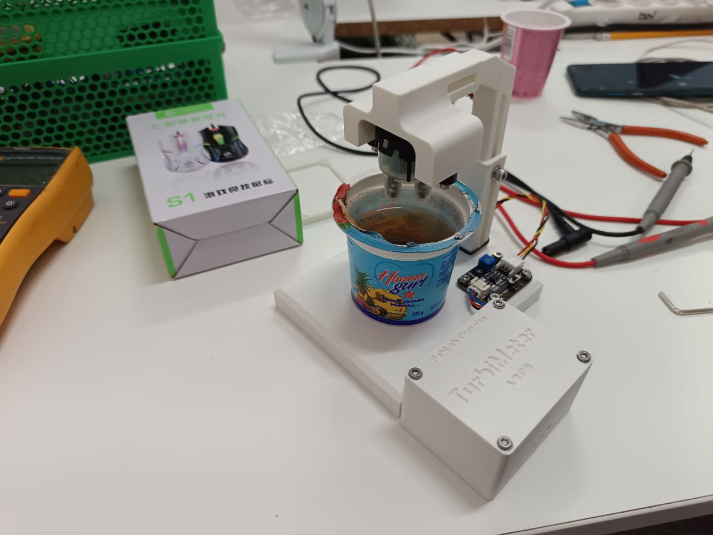

# Citizen-science turbidimeter

This repository tracks a **single, quantitative turbidimeter prototype**. The
target is to have the instrument, Android app, calibration, and validation
ready by **18 October 2026**. Community deployment follows that date.

## Current design target

- **Sensor:** 850 nm IR LED, BPW34 photodiode at 90° for scattered light, and
  a second BPW34 to monitor the LED. An MCP6002 dual amplifier and ADS1115
  read the two channels; a Seeed XIAO SAMD21 controls the LED.
- **Readout:** the Android phone supplies power through USB-C, displays the
  result, and will offer optional upload to the citizen-science website. The
  instrument has no battery, screen, or status LEDs.
- **Enclosure:** closed body with a fixed 2 m USB-C data cable through one M12
  cable gland. The technician cuts the sensor-side plug, routes the cable,
  then terminates and tests power, USB data, and USB-C configuration wiring
  before sealing. The selected cable has a 5.5 ± 0.15 mm outer diameter;
  the gland grips 3–6.5 mm cable.
- **Output:** a numeric NTU value is a *goal*, not a property of the current
  firmware. Dark-corrected scattered/reference readings must first be
  calibrated with known standards and validated on independent samples.

The [optical and validation plan](docs/optical-design.md) describes the work
remaining. The [one-unit shopping list](docs/shopping-list-prototype-usb-c.xlsx)
is in English, shows VAT-inclusive prices and full supplier URLs as text, and
totals **€76.52** for priced items. Calibration standards require a quote;
delivery is excluded. The PCB and cuvettes are already available, so they are
not in the list. Confirm the lid groove before buying or using the selected
O-ring assortment.

## Repository status

| Path | Status |
| --- | --- |
| [`docs/optical-design.md`](docs/optical-design.md) | Current design and validation plan |
| [`docs/BOM.md`](docs/BOM.md) | Procurement notes; workbook above is the purchase list |
| [`firmware/xiao_samd21_turbimeter/`](firmware/xiao_samd21_turbimeter/) | Current XIAO optical bench firmware; reports diagnostic counts and an uncalibrated ratio over USB |
| [`firmware/firmware.ino`](firmware/firmware.ino) | Experimental optical-index sketch; still uses TL072 and status LEDs, so it is **not** the final USB-C/NTU firmware |
| [`android-app/`](android-app/) | Android USB-CDC screen/controller prototype with a XIAO SAMD21 communication test |
| [`firmware/legacy_sen0189/`](firmware/legacy_sen0189/) | Original DFRobot SEN0189 firmware, retained for reference |
| [`hardware/`](hardware/) and [`3D/`](3D/) | Earlier PCB and enclosure files; mechanical/electrical revisions are pending |
| [`docs/diagrams/legacy-circuit-schematic.svg`](docs/diagrams/legacy-circuit-schematic.svg) | Earlier TL072 circuit illustration, not a build schematic for this design |

The original SEN0189 prototype is shown below. It is superseded by the
discrete 90° optical design.

## Before 18 October

1. Bench-test the LED, both photodiodes, MCP6002, ADS1115, and feedback
   values with the actual sample chamber.
2. Revise the PCB and enclosure, choose a lid seal that fits the final groove,
   and verify USB-C power/data plus cable-gland sealing.
3. Test the new XIAO firmware and Android app together on a USB-C phone; add
   optional upload when the citizen-science API is specified.
4. Calibrate against known turbidity standards, quantify repeatability and
   error across the intended range, and only then enable NTU reporting.

Community deployment is the phase after 18 October.
