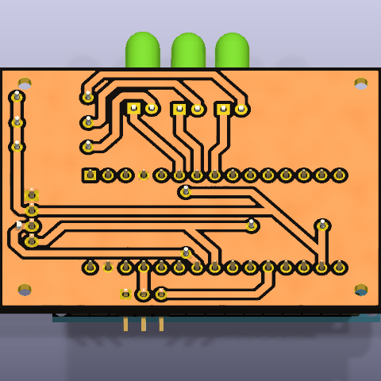
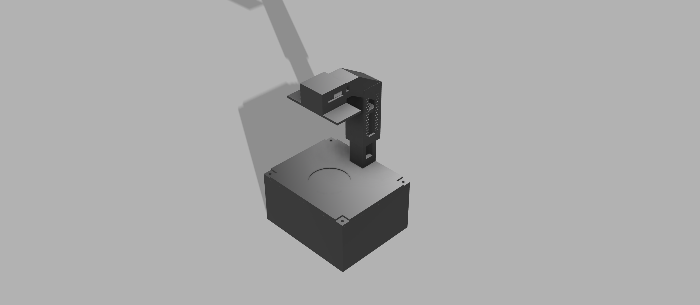
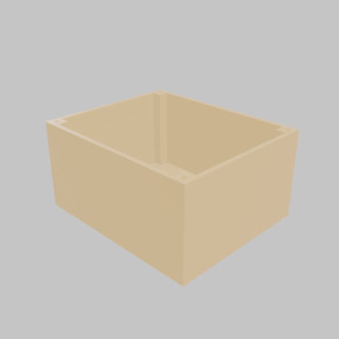
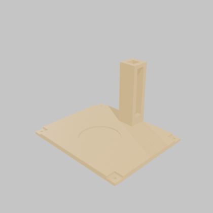
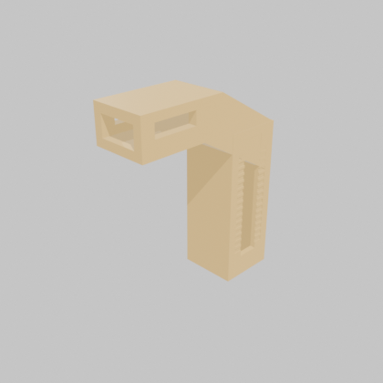
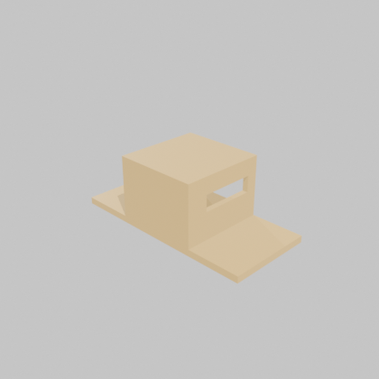

# Turbimeter - Citizen Science

Repository for the citizen-science turbidimeter project: 3D design, PCB, firmware, and data to measure water turbidity with community participation.


*The first prototype (SEN0189-based, now superseded — see the redesign below): 3D-printed enclosure, PCB, and sensor holder dipped in a test sample.*

> 🔧 **Sensor redesign in progress.** The DFRobot SEN0189 module turned out
> to be too noisy/low-quality for reliable readings. It's being replaced
> with a custom discrete 90° nephelometric sensor (real IR LED + photodiode
> optics, like actual turbidimeters use). Full writeup:
> **[docs/optical-design.md](docs/optical-design.md)**. The sections below
> are being updated to match; anything still describing the SEN0189 is the
> legacy design, kept for reference in
> [`firmware/legacy_sen0189/`](firmware/legacy_sen0189/).

## Table of contents

- [Structure](#structure)
- [Hardware](#hardware)
- [3D design (printing)](#3d-design-printing)
- [Bill of materials (BOM)](#bill-of-materials-bom)
- [Datasheets](#datasheets)
- [Firmware](#firmware)
  - [Hardware wiring](#hardware-wiring)
  - [General logic (loop)](#general-logic-loop)
  - [Calibration wizard](#why-theres-a-calibration-wizard)
  - [LED logic](#led-logic-evaluateleds)
  - [Full code](#full-code)
  - [Notes for anyone modifying the code](#notes-for-anyone-modifying-the-code)

## Structure

- `firmware/` - code for the sensor's microcontroller
- `hardware/` - schematics, PCB, 3D designs (KiCad project)
- `3D/` - parts for 3D printing (enclosure, sensor holder)
- `docs/` - documentation, BOM, datasheets, and guides
- `data/` - collected datasets
- `analysis/` - notebooks and data analysis scripts
- `img/` - photos and renders of the build/prototype

## Hardware

- **Sensor:** custom discrete 90° nephelometric sensor (IR LED + 2×
  photodiode + ADS1115) — see [docs/optical-design.md](docs/optical-design.md).
  *Legacy: DFRobot SEN0189, kept in [`firmware/legacy_sen0189/`](firmware/legacy_sen0189/).*
- **Controller:** Arduino Nano
- Full KiCad project in `hardware/`: schematic (`esque.kicad_sch`),
  PCB (`esque.kicad_pcb`), 3D model (`esque.step`), and manufacturing
  files (`hardware/gerber/`). ⚠️ This PCB was laid out for the legacy
  SEN0189 sensor — it still needs a revision for the new optical bench (see
  [docs/optical-design.md](docs/optical-design.md)); prototype the new
  sensor on a breadboard first.



*PCB render (`hardware/esque.step`) generated with `kicad-cli`.*



*Assembly render: Arduino Nano + sensor holder on top of the 3D-printed case.*

<details>
<summary><b>See the Arduino Nano pinout</b> (official Arduino reference)</summary>
<br>

</details>

## 3D design (printing)

Parts in [`3D/`](3D/), ready to download and print (STL). Clicking any file
on GitHub opens an interactive 3D preview right on the site; here's also a
spinning render of each part.

| Part | Preview | Download |
|------|:---:|:---:|
| **CASE** — main body, houses the Arduino Nano |  | [CASE.stl](3D/CASE.stl) |
| **LID** — case lid |  | [LID.stl](3D/LID.stl) |
| **NECK** — connects the case to the sensor holder |  | [NECK.stl](3D/NECK.stl) |
| **SENSOR-HOLDER** — mount for the *legacy* DFRobot SEN0189 sensor (⚠️ needs a redesign for the new 90° optical bench, see [docs/optical-design.md](docs/optical-design.md)) |  | [SENSOR-HOLDER.stl](3D/SENSOR-HOLDER.stl) |

## Bill of materials (BOM)

Full table and calibration notes in **[docs/BOM.md](docs/BOM.md)**.
Components pulled directly from the real schematic
(`kicad-cli sch export bom`), not made up. ⚠️ This table (and the schematic
it's from) still reflects the **legacy SEN0189 design** — the new discrete
sensor's parts (IR LED, 2× BPW34 photodiode, TL072, ADS1115) are listed
separately in [docs/optical-design.md](docs/optical-design.md#new-components)
until the schematic itself is updated:

| Photo | Component | Refs. | Qty | Buy |
|------|------------|:---:|:---:|:---:|
|  | Arduino Nano | A1 | 1 | [Arduino Store](https://store.arduino.cc/products/arduino-nano) |
|  | *(legacy)* DFRobot SEN0189 turbidity sensor | J2 | 1 | [DFRobot](https://www.dfrobot.com/product-1394.html) |
|  | 5mm LED (red/yellow/green) | D1-D3 | 3 | [SparkFun](https://www.sparkfun.com/led-assorted-20-pack.html) |
|  | 330 Ω resistor, 1/4W | R1-R3, R5, R6 | 5 | [SparkFun](https://www.sparkfun.com/resistor-330-ohm-1-4-watt-pth-20-pack-thick-leads.html) |
|  | 2.54mm pin header | J2, J3 | 1 strip | [SparkFun](https://www.sparkfun.com/break-away-headers-straight.html) |
|  | Female-to-female jumper wires | — | ~4 | [SparkFun](https://www.sparkfun.com/jumper-wires-premium-6-f-f-pack-of-10.html) |

<details>
<summary><b>How do you read a resistor's color code?</b></summary>
<br>


*Diagram: SparkFun Learn - Resistors.*
</details>

<details>
<summary><b>Why does the LED need a series resistor?</b></summary>
<br>


*The resistor limits the current through the LED so it doesn't burn out. Diagram: SparkFun Learn.*
</details>

## Datasheets

| Component | File |
|------------|---------|
| Arduino Nano (A000005) | [docs/datasheets/arduino-nano.pdf](docs/datasheets/arduino-nano.pdf) |
| *(legacy)* DFRobot SEN0189 turbidity sensor | [docs/datasheets/dfrobot-sen0189.pdf](docs/datasheets/dfrobot-sen0189.pdf) |

## Firmware

[`firmware/firmware.ino`](firmware/firmware.ino) drives the new discrete
90° optical sensor from an Arduino Nano: it pulses an IR LED, reads two
photodiode channels through an external ADS1115 ADC, computes a ratiometric
**turbidity index**, and turns on an LED (green/yellow/red) based on the
detected level. It includes the same interactive calibration wizard over
the Serial Monitor as the legacy version. Full optical/electrical design:
**[docs/optical-design.md](docs/optical-design.md)**.

*(The old SEN0189-based firmware — analog read, fabricated NTU formula —
is preserved in [`firmware/legacy_sen0189/firmware.ino`](firmware/legacy_sen0189/firmware.ino)
and explained in [docs/firmware.md](docs/firmware.md).)*

### Hardware wiring

| From | To |
|------|-----|
| IR LED anode | Nano D7, through a 220Ω resistor |
| IR LED cathode | GND |
| Photodiode A (90°, measurement) | TL072 channel A → ADS1115 AIN0 |
| Photodiode B (reference, near the LED) | TL072 channel B → ADS1115 AIN1 |
| ADS1115 VDD / GND / ADDR | 5V / GND / GND (I2C address 0x48) |
| ADS1115 SDA / SCL | Nano A4 / A5 |


*90° nephelometric geometry — full schematic in [docs/optical-design.md](docs/optical-design.md).*

There are also 3 indicator LEDs (green/yellow/red) on configurable digital
pins (10, 9, and 8 by default) to visually show the turbidity level without
needing to watch the Serial Monitor.

### General logic (`loop`)

1. **LED off, read both channels:** averages several ADS1115 readings on
   AIN0 (90° photodiode) and AIN1 (reference photodiode) to get a "dark"
   baseline — this captures ambient IR light (sunlight, room lighting).
2. **LED on, read both channels again:** same averaging, now with the LED
   lit.
3. **Subtract the dark baseline** from each channel's lit reading. This
   cancels out ambient light, leaving only the signal actually caused by
   the LED.
4. **Divide**: `index = scatteredSignal / referenceSignal`. Dividing by the
   reference channel (which tracks the LED's own brightness) cancels drift
   from the LED aging or heating up — something the old single-channel
   design couldn't do.
5. **Output:** the two signals and the resulting index are printed to the
   Serial Monitor, and if not currently calibrating, the index is evaluated
   to turn on the right LED.

Unlike the legacy firmware, there's no fabricated NTU formula here — the
`index` is an honest, physically meaningful ratio, just not yet an
absolute/traceable NTU value (see
[docs/optical-design.md#getting-to-absolute-ntu](docs/optical-design.md#getting-to-absolute-ntu)
for that next step).

### Why there's a calibration wizard

The `index` is a relative measurement, so the code doesn't guess when to
turn on each LED — it calibrates the **thresholds** using real water
samples from the actual sensor:

1. Type `C` in the Serial Monitor to start.
2. You're asked to dip the sensor in **clear water**, fixed with `F`.
3. You're asked for **medium turbidity water** (suggests yellow dye), fixed
   with `F`.
4. You're asked for **high turbidity water** (suggests coffee or dark ink),
   fixed with `F`.
5. You finish with `X`, which:
   - Calculates the thresholds as the midpoint between each pair of samples
     (`recalculateThresholds()`).
   - Saves the 3 reference index values to the Arduino's **EEPROM**
     (`saveCalibrationToEEPROM()`), so the calibration isn't lost when the
     device is powered off.

On power-up, `loadCalibrationFromEEPROM()` checks whether a calibration was
already saved (using a "flag" at EEPROM address 12) and, if so, loads it
instead of using the default values.

### LED logic (`evaluateLeds`)

With the 3 calibrated points (clear / medium / turbid), two intermediate
thresholds are calculated:

- `MEDIUM_TURBIDITY_THRESHOLD` = midpoint between "clear" and "medium"
- `HIGH_TURBIDITY_THRESHOLD` = midpoint between "medium" and "turbid"

Then:

- index > `HIGH_TURBIDITY_THRESHOLD` → **red LED** (high turbidity)
- index > `MEDIUM_TURBIDITY_THRESHOLD` → **yellow LED** (medium turbidity)
- otherwise → **green LED** (low turbidity)

### Full code

<details>
<summary><b>View the complete <code>firmware/firmware.ino</code></b> (click to expand — the copy button appears at the top right of the code block)</summary>

```cpp
/*
  ============================================================
   DISCRETE 90 DEGREE NEPHELOMETRIC TURBIDITY SENSOR
   ARDUINO NANO + IR LED + 2x BPW34 PHOTODIODE + TL072 + ADS1115
  ============================================================
  Description:
   Replaces the DFRobot SEN0189 module with a custom optical
   bench: an IR LED shines into the sample, a photodiode placed
   at 90 DEGREES from the LED picks up SCATTERED light
   (nephelometry, same principle as ISO 7027 turbidimeters),
   and a second "reference" photodiode near the LED tracks the
   LED's own brightness so drift (temperature, aging) cancels
   out. Both photodiode signals are amplified by a transimpedance
   op-amp (TL072) and read through an external 16-bit ADC
   (ADS1115) instead of the Nano's own 10-bit ADC.

   Full schematic, optical geometry, part numbers and purchase
   links: docs/optical-design.md and docs/diagrams/*.svg

  *** WHY THIS INSTEAD OF THE OLD SEN0189 FORMULA ***
   The old firmware (see firmware/legacy_sen0189/) computed a
   fake "NTU" from a straight-through (0 degree) analog reading
   using a generic community formula with no physical basis, and
   read it through the Nano's noisy 10-bit ADC. This version
   reports an honest, uncalibrated TURBIDITY INDEX instead of a
   fabricated NTU number - it is NOT yet an absolute NTU value.
   Turning it into real NTU requires calibrating against a
   reference instrument or formazin standards (see
   docs/optical-design.md, section "Getting to absolute NTU").

  Wiring summary (see docs/diagrams/circuit-schematic.svg):
   - IR LED (850nm)  -> D7 through a 220ohm resistor -> GND
   - Photodiode A (measurement, at 90 degrees) -> TL072 channel A
     (transimpedance amp) -> ADS1115 AIN0
   - Photodiode B (reference, near the LED)    -> TL072 channel B
     (transimpedance amp) -> ADS1115 AIN1
   - ADS1115: VDD->5V, GND->GND, ADDR->GND (I2C address 0x48),
     SDA->Nano A4, SCL->Nano A5

  REQUIRED LIBRARIES:
   - None beyond what ships with the Arduino IDE. <Wire.h> is
     used for I2C, talking to the ADS1115 directly via its
     register interface (no Adafruit_ADS1X15 dependency), the
     same "no external library" philosophy as the original
     firmware. <EEPROM.h> is used to store the calibration.

  ============================================================
                 CALIBRATION GUIDE (Serial Monitor)
  ============================================================
   1. Open the Serial Monitor (Ctrl+Shift+M) at 9600 baud.
   2. Type the letter  C  and press Enter -> starts calibration.
   3. The program will ask you to dip the sensor in CLEAR water
      (pure water). Wait for the reading to stabilize and type
      F  + Enter to fix that point.
   4. Then it will ask for WATER WITH YELLOW DYE (medium turbidity).
      Dip the sensor, wait for it to stabilize, and type
      F  + Enter to fix that point.
   5. Then it will ask for WATER WITH DISSOLVED COFFEE OR DARK INK
      (high turbidity). Dip the sensor, wait for it to stabilize,
      and type  F  + Enter to fix that point.
   6. Finally type  X  + Enter to FINISH the calibration. The
      values are calculated and automatically saved to EEPROM.
  ============================================================
*/

#include <Wire.h>
#include <EEPROM.h>

// ------------------- PIN CONFIGURATION -------------------

const int LED_DRIVE_PIN = 7; // Drives the IR LED (through a 220ohm resistor)

// >>> SET THE DIGITAL PINS YOU'RE ACTUALLY USING HERE <<<
const int RED_LED_PIN    = 8;   // <-- CHANGE: status RED LED digital pin
const int YELLOW_LED_PIN = 9;   // <-- CHANGE: status YELLOW LED digital pin
const int GREEN_LED_PIN  = 10;  // <-- CHANGE: status GREEN LED digital pin

const int SAMPLES_PER_READING = 8; // ADS1115 reads to average per state (dark/lit)
const int LED_SETTLE_MS = 5;       // Wait after switching the LED before reading

// ------------------- ADS1115 (RAW I2C, NO LIBRARY) -------------------
const uint8_t ADS1115_ADDRESS = 0x48;      // ADDR pin tied to GND
const uint8_t ADS1115_REG_CONVERSION = 0x00;
const uint8_t ADS1115_REG_CONFIG = 0x01;
const int MEASUREMENT_CHANNEL = 0; // AIN0 <- photodiode A (90 degrees)
const int REFERENCE_CHANNEL   = 1; // AIN1 <- photodiode B (near the LED)
const float ADS1115_LSB_VOLTS = 4.096 / 32768.0; // Gain = +/-4.096V (config below)

// ------------------- EEPROM MEMORY ADDRESSES -------------------
const int CLEAR_INDEX_ADDRESS     = 0;
const int MEDIUM_INDEX_ADDRESS    = 4;
const int TURBID_INDEX_ADDRESS    = 8;
const int CALIBRATED_FLAG_ADDRESS = 12; // Flag: 1 = already calibrated before

// ------------------- CALIBRATION VARIABLES (TURBIDITY INDEX, NOT NTU) -------------------
float clearWaterIndex  = 0.05;  // Default value until calibrated
float mediumWaterIndex = 0.25;  // Default value until calibrated
float turbidWaterIndex = 0.60;  // Default value until calibrated

float HIGH_TURBIDITY_THRESHOLD;
float MEDIUM_TURBIDITY_THRESHOLD;

// ------------------- CALIBRATION STATE VARIABLES -------------------
bool calibrating = false;
int  calibrationStep = 0; // 0=inactive, 1=clear water, 2=medium water, 3=turbid water


void setup() {
  Serial.begin(9600);
  Wire.begin();

  pinMode(LED_DRIVE_PIN, OUTPUT);
  digitalWrite(LED_DRIVE_PIN, LOW);

  pinMode(RED_LED_PIN, OUTPUT);
  pinMode(YELLOW_LED_PIN, OUTPUT);
  pinMode(GREEN_LED_PIN, OUTPUT);
  turnOffAllLeds();

  loadCalibrationFromEEPROM();
  recalculateThresholds();

  Serial.println("============================================");
  Serial.println(" Discrete 90-degree turbidity sensor");
  Serial.println(" Reporting a relative TURBIDITY INDEX (not NTU)");
  Serial.println(" Type 'C' + Enter to start calibration");
  Serial.println("============================================");
}


void loop() {

  if (Serial.available() > 0) {
    char receivedKey = Serial.read();
    processKey(receivedKey);
  }

  float measurementSignal, referenceSignal;
  float index = readTurbidityIndex(measurementSignal, referenceSignal);

  Serial.print("Scatter: ");
  Serial.print(measurementSignal, 4);
  Serial.print(" V | Reference: ");
  Serial.print(referenceSignal, 4);
  Serial.print(" V | Index: ");
  Serial.print(index, 4);

  if (calibrating) {
    Serial.print("   [CALIBRATING - Step ");
    Serial.print(calibrationStep);
    Serial.println(" of 3]");
  } else {
    Serial.print("  |  Status: ");
    evaluateLeds(index);
  }

  delay(300);
}


// ============================================================
//              SENSOR READING (LED ON/OFF DIFFERENCING)
// ============================================================

// Reads both photodiode channels with the LED off, then with the LED on,
// and returns the ambient-corrected ratio (scattered / reference).
// Also returns the two corrected signals (in volts) via the reference args,
// mainly for debugging/logging over Serial.
float readTurbidityIndex(float &measurementSignalOut, float &referenceSignalOut) {
  digitalWrite(LED_DRIVE_PIN, LOW);
  delay(LED_SETTLE_MS);
  float darkMeasurement = readAveragedChannel(MEASUREMENT_CHANNEL);
  float darkReference   = readAveragedChannel(REFERENCE_CHANNEL);

  digitalWrite(LED_DRIVE_PIN, HIGH);
  delay(LED_SETTLE_MS);
  float litMeasurement = readAveragedChannel(MEASUREMENT_CHANNEL);
  float litReference   = readAveragedChannel(REFERENCE_CHANNEL);

  digitalWrite(LED_DRIVE_PIN, LOW); // off between cycles

  float measurementSignal = litMeasurement - darkMeasurement;
  float referenceSignal   = litReference - darkReference;

  measurementSignalOut = measurementSignal;
  referenceSignalOut = referenceSignal;

  // Guard against divide-by-zero / a disconnected or dead reference channel
  if (referenceSignal < 0.001) {
    return 0.0;
  }
  return measurementSignal / referenceSignal;
}

// Reads one ADS1115 channel multiple times and returns the average in volts
float readAveragedChannel(int channel) {
  long sum = 0;
  for (int i = 0; i < SAMPLES_PER_READING; i++) {
    sum += readADS1115Raw(channel);
  }
  float averageRaw = sum / (float)SAMPLES_PER_READING;
  return averageRaw * ADS1115_LSB_VOLTS;
}

// Triggers a single-shot conversion on the given single-ended channel (0-3)
// and returns the raw 16-bit signed result. Talks to the ADS1115 directly
// over I2C, no external library needed.
int16_t readADS1115Raw(int channel) {
  // Config register bits:
  //   OS=1 (start), MUX=100+channel (single-ended vs GND),
  //   PGA=001 (+/-4.096V), MODE=1 (single-shot),
  //   DR=100 (128SPS), COMP_QUE=11 (disable comparator)
  uint16_t config = 0x8000;               // OS = 1 (start single conversion)
  config |= (uint16_t)(0x04 + channel) << 12; // MUX
  config |= 0x1 << 9;                     // PGA = +/-4.096V
  config |= 0x1 << 8;                     // MODE = single-shot
  config |= 0x4 << 5;                     // DR = 128SPS
  config |= 0x3;                          // COMP_QUE = disabled

  writeADS1115Register(ADS1115_REG_CONFIG, config);
  delay(9); // ~1 conversion period at 128SPS, plus margin

  return (int16_t)readADS1115Register(ADS1115_REG_CONVERSION);
}

void writeADS1115Register(uint8_t reg, uint16_t value) {
  Wire.beginTransmission(ADS1115_ADDRESS);
  Wire.write(reg);
  Wire.write((uint8_t)(value >> 8));   // MSB
  Wire.write((uint8_t)(value & 0xFF)); // LSB
  Wire.endTransmission();
}

uint16_t readADS1115Register(uint8_t reg) {
  Wire.beginTransmission(ADS1115_ADDRESS);
  Wire.write(reg);
  Wire.endTransmission();

  Wire.requestFrom((int)ADS1115_ADDRESS, 2);
  uint16_t value = 0;
  if (Wire.available() >= 2) {
    value = (uint16_t)Wire.read() << 8; // MSB
    value |= Wire.read();               // LSB
  }
  return value;
}

// ============================================================
//                   CALIBRATION FUNCTIONS
// ============================================================

void processKey(char key) {

  if (key == 'C' || key == 'c') {
    calibrating = true;
    calibrationStep = 1;
    Serial.println();
    Serial.println("### CALIBRATION STARTED ###");
    Serial.println("Step 1/3: Dip the sensor in CLEAR (pure) water.");
    Serial.println("Once the reading stabilizes, type 'F' + Enter.");
  }
  else if ((key == 'F' || key == 'f') && calibrating) {
    float measurementSignal, referenceSignal;
    float currentIndex = readTurbidityIndex(measurementSignal, referenceSignal);

    if (calibrationStep == 1) {
      clearWaterIndex = currentIndex;
      Serial.print("Value fixed for CLEAR WATER: ");
      Serial.println(currentIndex, 4);
      Serial.println("Step 2/3: Dip the sensor in WATER WITH YELLOW DYE.");
      Serial.println("Once the reading stabilizes, type 'F' + Enter.");
      calibrationStep = 2;
    }
    else if (calibrationStep == 2) {
      mediumWaterIndex = currentIndex;
      Serial.print("Value fixed for MEDIUM (yellow) WATER: ");
      Serial.println(currentIndex, 4);
      Serial.println("Step 3/3: Dip the sensor in WATER WITH COFFEE/DARK INK.");
      Serial.println("Once the reading stabilizes, type 'F' + Enter.");
      calibrationStep = 3;
    }
    else if (calibrationStep == 3) {
      turbidWaterIndex = currentIndex;
      Serial.print("Value fixed for TURBID (dark) WATER: ");
      Serial.println(currentIndex, 4);
      Serial.println("All 3 points have been fixed.");
      Serial.println("Type 'X' + Enter to FINISH and save the calibration.");
      calibrationStep = 4;
    }
    else {
      Serial.println("You already fixed the 3 points. Type 'X' to finish.");
    }
  }
  else if ((key == 'X' || key == 'x') && calibrating) {
    if (calibrationStep < 4) {
      Serial.println("You haven't fixed the 3 points with 'F' yet. Can't finish yet.");
    } else {
      recalculateThresholds();
      saveCalibrationToEEPROM();
      calibrating = false;
      calibrationStep = 0;
      Serial.println("### CALIBRATION FINISHED AND SAVED TO MEMORY ###");
      Serial.println("Returning to normal operation...");
      Serial.println();
    }
  }
}

// Calculates the LED thresholds as midpoints between the 3 calibrated samples
void recalculateThresholds() {
  MEDIUM_TURBIDITY_THRESHOLD = (clearWaterIndex + mediumWaterIndex) / 2.0;
  HIGH_TURBIDITY_THRESHOLD   = (mediumWaterIndex + turbidWaterIndex) / 2.0;
}

void saveCalibrationToEEPROM() {
  EEPROM.put(CLEAR_INDEX_ADDRESS, clearWaterIndex);
  EEPROM.put(MEDIUM_INDEX_ADDRESS, mediumWaterIndex);
  EEPROM.put(TURBID_INDEX_ADDRESS, turbidWaterIndex);
  EEPROM.put(CALIBRATED_FLAG_ADDRESS, (byte)1);
}

void loadCalibrationFromEEPROM() {
  byte calibratedFlag;
  EEPROM.get(CALIBRATED_FLAG_ADDRESS, calibratedFlag);

  if (calibratedFlag == 1) {
    EEPROM.get(CLEAR_INDEX_ADDRESS, clearWaterIndex);
    EEPROM.get(MEDIUM_INDEX_ADDRESS, mediumWaterIndex);
    EEPROM.get(TURBID_INDEX_ADDRESS, turbidWaterIndex);
    Serial.println("A previously saved calibration was loaded.");
  } else {
    Serial.println("No saved calibration found. Using default values.");
  }
}

// ============================================================
//                     STATUS LED FUNCTIONS
// ============================================================

void turnOffAllLeds() {
  digitalWrite(RED_LED_PIN, LOW);
  digitalWrite(YELLOW_LED_PIN, LOW);
  digitalWrite(GREEN_LED_PIN, LOW);
}

void evaluateLeds(float index) {
  if (index > HIGH_TURBIDITY_THRESHOLD) {
    digitalWrite(RED_LED_PIN, HIGH);
    digitalWrite(YELLOW_LED_PIN, LOW);
    digitalWrite(GREEN_LED_PIN, LOW);
    Serial.println("HIGH TURBIDITY - RED LED");
  }
  else if (index > MEDIUM_TURBIDITY_THRESHOLD) {
    digitalWrite(RED_LED_PIN, LOW);
    digitalWrite(YELLOW_LED_PIN, HIGH);
    digitalWrite(GREEN_LED_PIN, LOW);
    Serial.println("MEDIUM TURBIDITY - YELLOW LED");
  }
  else {
    digitalWrite(RED_LED_PIN, LOW);
    digitalWrite(YELLOW_LED_PIN, LOW);
    digitalWrite(GREEN_LED_PIN, HIGH);
    Serial.println("LOW TURBIDITY - GREEN LED");
  }
}
```

</details>

### Notes for anyone modifying the code

- The status LED pins (`RED_LED_PIN`/`YELLOW_LED_PIN`/`GREEN_LED_PIN`) are
  marked as `<-- CHANGE` because they depend on how each board is wired.
- `SAMPLES_PER_READING = 8` averages 8 ADS1115 conversions per state
  (dark/lit) per channel — at 128SPS that's a full reading cycle (dark +
  lit, 2 channels each) in well under a second. Raise it for more noise
  averaging at the cost of a slower refresh.
- The 1MΩ feedback resistors on the TIA (see
  [docs/optical-design.md](docs/optical-design.md)) are what actually sets
  the sensitivity — if readings clip or look too flat, that's the first
  thing to retune, not the firmware.
- `readADS1115Raw()` talks to the ADS1115 over raw I2C registers instead of
  a library, matching this project's "no external dependencies" approach.
  If that's ever inconvenient, swapping in `Adafruit_ADS1X15` is a
  drop-in alternative.

*(The legacy SEN0189 firmware is explained in [docs/firmware.md](docs/firmware.md). The new design's full writeup, BOM and path to absolute NTU: [docs/optical-design.md](docs/optical-design.md).)*
