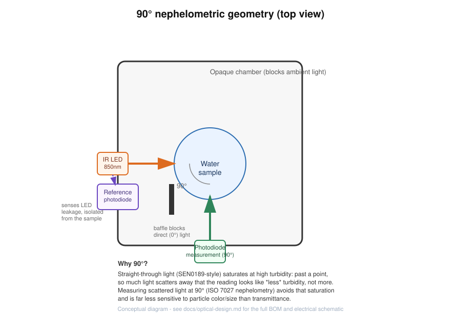
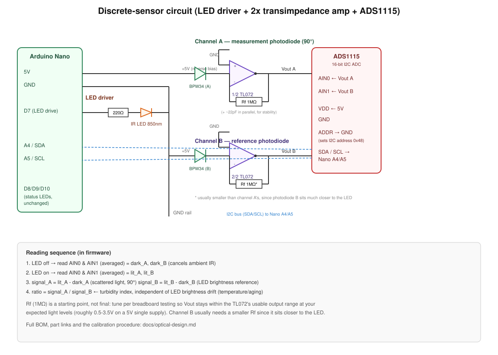

# Optical redesign: discrete 90° nephelometric sensor

This replaces the DFRobot SEN0189 module (straight-through, 0°, 10-bit ADC,
no LED-drift compensation) with a custom optical bench built from discrete
parts, following the same principle real turbidimeters use (ISO 7027
nephelometry). The old SEN0189-based firmware is kept for reference in
[`firmware/legacy_sen0189/`](../firmware/legacy_sen0189/).

## The principle

- An **IR LED** shines through the water sample.
- A **photodiode placed at 90°** from the LED's beam picks up light
  *scattered* by suspended particles — not light that passed straight
  through. This is what "NTU" (Nephelometric Turbidity Unit) is defined
  against, and it doesn't saturate/invert at high turbidity the way
  straight-through transmittance does.
- A second **reference photodiode**, near the LED and shielded from the
  sample, tracks the LED's own brightness. Dividing the 90° signal by the
  reference signal cancels drift from LED aging/temperature — something
  none of the DFRobot sensors we evaluated do.
- Both signals are read through an **ADS1115** (external 16-bit ADC)
  instead of the Nano's built-in 10-bit ADC, for much better resolution and
  noise performance.

## Circuit

Full wiring table:

| From | To |
|------|-----|
| IR LED anode | Nano D7, through a 220Ω resistor |
| IR LED cathode | GND |
| Photodiode A (90°) cathode | +5V |
| Photodiode A anode | TL072 channel A inverting input |
| TL072 channel A output | ADS1115 AIN0 |
| Photodiode B (reference) cathode | +5V |
| Photodiode B anode | TL072 channel B inverting input |
| TL072 channel B output | ADS1115 AIN1 |
| Feedback resistor (1MΩ, per channel) | Between each op-amp's inverting input and its output |
| ADS1115 VDD | 5V |
| ADS1115 GND, ADDR | GND (ADDR→GND sets I2C address 0x48) |
| ADS1115 SDA / SCL | Nano A4 / A5 |

The 1MΩ feedback resistors are a starting point, not a final value — tune
them on the breadboard so each op-amp's output lands roughly between 0.5V
and 3.5V at your expected light levels (photodiode B, right next to the
LED, usually needs a *smaller* resistor than photodiode A, since it
receives far more light).

**Recommendation: prototype this on a breadboard before touching the PCB.**
The existing `hardware/esque.kicad_pcb` was laid out for the SEN0189 +
status LEDs, not for this optical bench — it needs a new PCB revision
(new footprints, the 90° mechanical layout, the sample chamber cutout).
That's a separate next step once the breadboard version is validated and
the resistor values are tuned for your actual LED/photodiode batch.

## New components

| Photo | Component | Qty/unit | Buy |
|------|------------|:---:|:---:|
|  | IR LED, 850nm, 5mm | 1 | [Amazon (100-pack)](https://www.amazon.com/850nm-Infrared-nighe-verison-Camera/dp/B082NWVJHR) |
|  | BPW34 silicon PIN photodiode | 2 | [Amazon (5-pack)](https://www.amazon.com/Comimark-BPW34-Silicon-Photodiode-DIP-2/dp/B087NK42MY) / [DigiKey](https://www.digikey.com/en/products/detail/vishay-semiconductor-opto-division/BPW34/1681149) |
|  | TL072 dual JFET op-amp (DIP-8) | 1 | [Amazon (2-pack)](https://www.amazon.com/Juried-Engineering-TL072CP-Operational-Breadboard-Friendly/dp/B08D6782QP) |
|  | ADS1115 16-bit I2C ADC module | 1 | [Amazon (3-pack)](https://www.amazon.com/HiLetgo-Converter-Programmable-Amplifier-Development/dp/B07VPFLSMX) |

Plus, from the existing [BOM](BOM.md): 1× 220Ω-330Ω resistor for the LED,
and 2× 1MΩ resistors for the feedback (not yet in the resistor kit listed
there — add a 1MΩ pack when ordering). The DFRobot SEN0189 line item is no
longer needed.

**Rough cost per unit** (buying small packs, not bulk): IR LED ~$0.10-0.70
+ 2× BPW34 ~$2.40-3.60 + TL072 ~$0.20-1 + ADS1115 ~$3-4 ≈ **$6-10 total** —
in the same ballpark as the SEN0554 upgrade we evaluated earlier, but with
real 90° nephelometric geometry and LED-drift compensation instead of a
closed-firmware black box.

## What the firmware reports now

[`firmware/firmware.ino`](../firmware/firmware.ino) no longer computes a
fabricated "NTU" from an unjustified formula. Instead it reports an honest
**turbidity index** = (90° scattered signal) / (reference signal), both
corrected for ambient light by reading each channel with the LED off and
on and subtracting. This index is:

- **Physically meaningful** (it's a real ratio of measured light, not a
  guessed polynomial).
- **Not yet an absolute NTU value** — same caveat as before, it needs
  calibration against a real reference to become traceable NTU.
- Used with the same 3-point calibration wizard as before (`C`, `F`, `X`
  over Serial) to set relative low/medium/high thresholds for the status
  LEDs.

## Getting to absolute NTU

Once this optical design is validated and you want real, traceable NTU
numbers (see the earlier discussion in this project about what NTU means):

1. Get **one** reference point source — either a real turbidimeter reading
   (borrow/rent one, or ask a local water utility/university lab to run a
   few of your water samples) or formazin standard solutions.
2. Take several real-world samples spanning your range of interest (e.g.
   clear tap water, slightly cloudy, very turbid) and record both the
   reference NTU and this sensor's `index` for each.
3. Fit a line (or simple curve) `NTU ≈ m × index + b` from those points —
   the ratiometric signal from a proper 90° design is usually much more
   linear than the SEN0189's raw voltage ever was, so a linear fit should
   go a long way.
4. Bake that fit into the firmware (replacing the raw `index` output) once
   you've built enough units with the *same* LED/photodiode batch that the
   fit reasonably transfers between them.

This is real calibration work (see the earlier price/time comparison for
formazin vs. a reference instrument) — worth doing once the optical design
itself is confirmed to behave well, not before.
